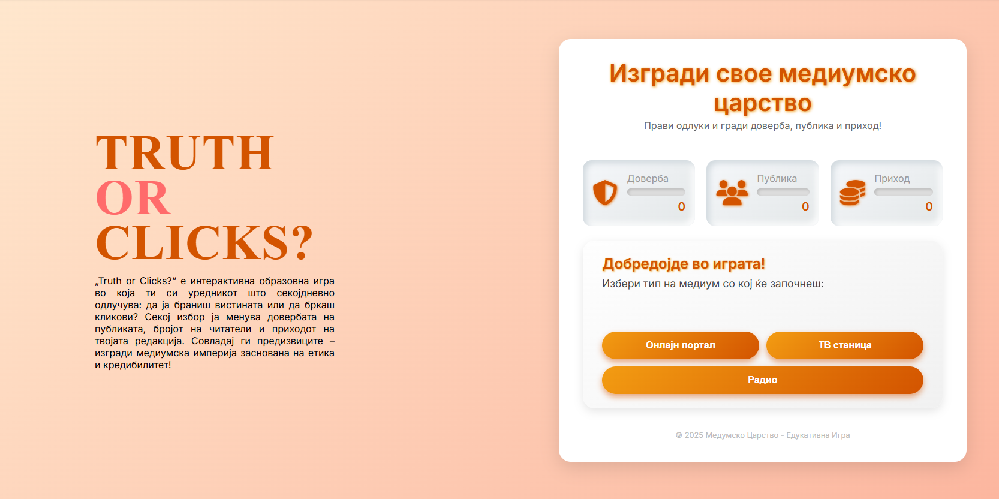

# Truth or Clicks? – Interactive media game in Macedonian



“Truth or Clicks?” is a small web game where you decide whether to defend the truth or chase clicks. 
Every decision affects three indicators – Trust, Audience, and Revenue – so your goal is to build a media empire without losing your credibility.


## 💻 Run Locally

```bash
git clone https://github.com/<твоето-корисничко-име>/truth-or-clicks.git
cd truth-or-clicks
# доволно е да отвориш index.html, или
npx serve .
